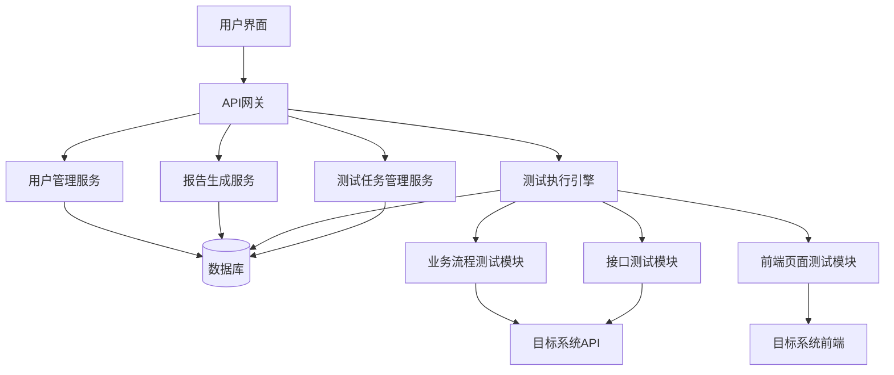
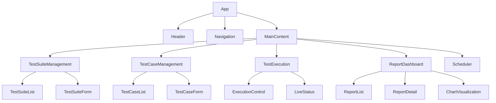
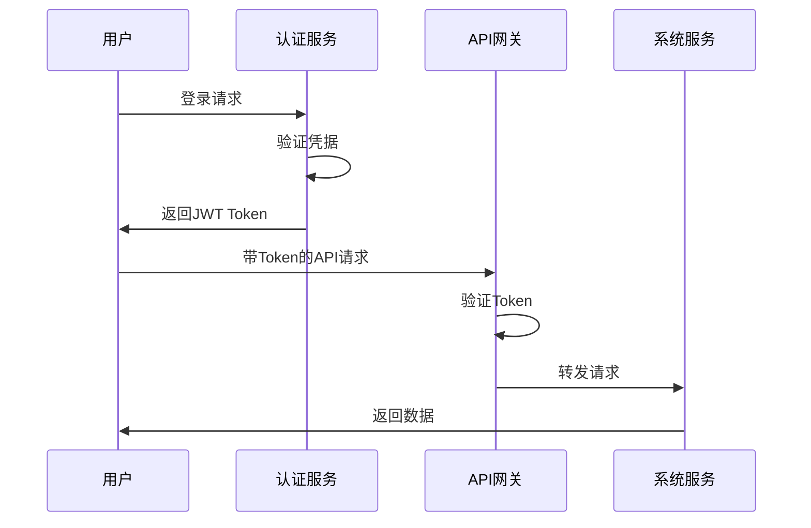
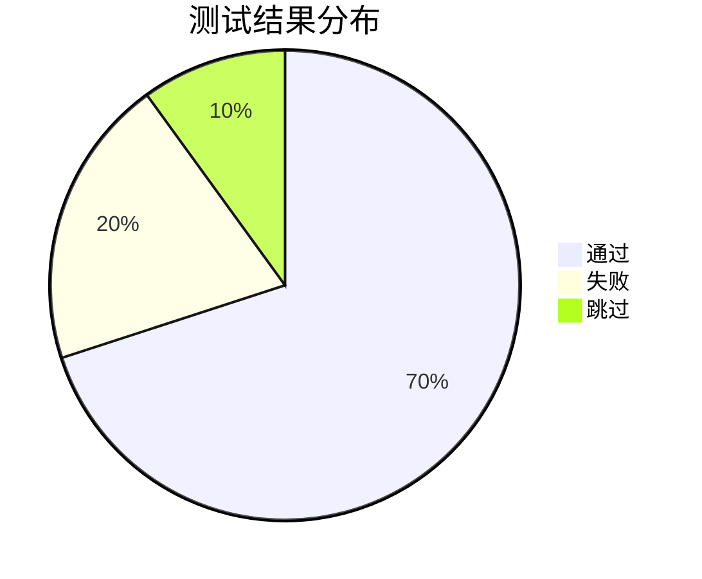
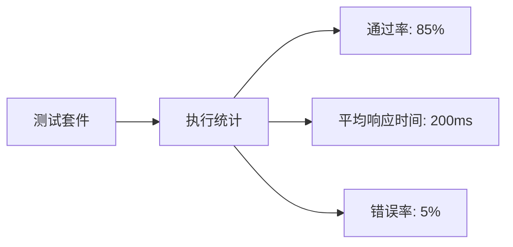
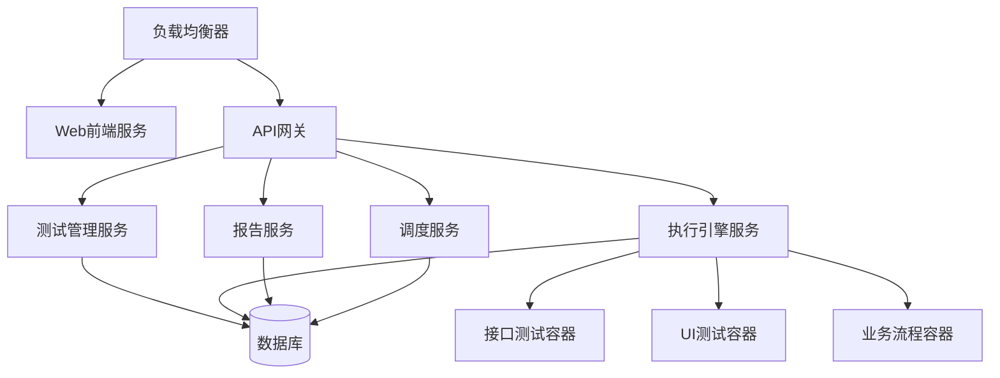

# 系统测试服务平台开发设计文档

## 1. 概述

### 1.1 项目背景
系统测试服务平台是一个综合性的自动化测试解决方案，旨在提供对目标系统的全面测试能力，包括后端接口测试、业务流程自动化测试以及前端页面测试，并最终生成详细的测试报告。

### 1.2 核心功能
- 接口自动化测试
- 业务流程自动化测试
- 前端页面自动化测试
- 测试报告生成与展示
- 测试任务调度与管理

## 2. 架构设计

### 2.1 整体架构


### 2.2 技术栈选择
- 后端: Node.js/Express 或 Java/Spring Boot
- 前端: React/Vue.js
- 数据库: PostgreSQL/MongoDB
- 接口测试: REST Assured/Postman/Newman
- 前端测试: Selenium/Cypress/Playwright
- 业务流程: Robot Framework/Cucumber
- 容器化: Docker/Kubernetes

## 3. 前端架构

### 3.1 组件树


### 3.2 状态管理
使用Redux/Zustand管理全局状态:
- 用户认证信息
- 测试套件数据
- 测试执行状态
- 报告数据

### 3.3 API客户端
封装统一的API客户端用于与后端服务通信:
- 测试套件API
- 测试用例API
- 执行API
- 报告API

## 4. 后端架构

### 4.1 API端点设计

#### 测试套件管理
| 端点 | 方法 | 描述 |
|------|------|------|
| /api/test-suites | GET | 获取测试套件列表 |
| /api/test-suites | POST | 创建测试套件 |
| /api/test-suites/{id} | GET | 获取测试套件详情 |
| /api/test-suites/{id} | PUT | 更新测试套件 |
| /api/test-suites/{id} | DELETE | 删除测试套件 |

#### 测试用例管理
| 端点 | 方法 | 描述 |
|------|------|------|
| /api/test-cases | GET | 获取测试用例列表 |
| /api/test-cases | POST | 创建测试用例 |
| /api/test-cases/{id} | GET | 获取测试用例详情 |
| /api/test-cases/{id} | PUT | 更新测试用例 |
| /api/test-cases/{id} | DELETE | 删除测试用例 |

#### 测试执行
| 端点 | 方法 | 描述 |
|------|------|------|
| /api/executions | POST | 启动测试执行 |
| /api/executions/{id} | GET | 获取执行状态 |
| /api/executions/{id} | DELETE | 停止执行 |

#### 报告管理
| 端点 | 方法 | 描述 |
|------|------|------|
| /api/reports | GET | 获取报告列表 |
| /api/reports/{id} | GET | 获取报告详情 |
| /api/reports/{id}/download | GET | 下载报告 |

### 4.2 数据模型设计

#### 测试套件模型
```json
{
  "id": "string",
  "name": "string",
  "description": "string",
  "type": "enum[API, UI, BUSINESS]",
  "createdAt": "datetime",
  "updatedAt": "datetime",
  "testCases": ["testCaseId"]
}
```

#### 测试用例模型
```json
{
  "id": "string",
  "suiteId": "string",
  "name": "string",
  "description": "string",
  "type": "enum[API, UI, BUSINESS]",
  "config": "object",
  "createdAt": "datetime",
  "updatedAt": "datetime"
}
```

#### 测试执行模型
```json
{
  "id": "string",
  "suiteId": "string",
  "status": "enum[PENDING, RUNNING, COMPLETED, FAILED]",
  "startTime": "datetime",
  "endTime": "datetime",
  "result": "object"
}
```

#### 测试报告模型
```json
{
  "id": "string",
  "executionId": "string",
  "suiteId": "string",
  "name": "string",
  "summary": "object",
  "details": "array",
  "createdAt": "datetime"
}
```

### 4.3 认证流程


## 5. 测试执行引擎

### 5.1 接口测试模块
支持HTTP/HTTPS协议的API测试:
- RESTful API测试
- GraphQL测试
- SOAP Web服务测试
- 请求/响应验证
- 性能指标收集

### 5.2 业务流程测试模块
支持复杂业务场景的自动化测试:
- 多步骤业务流程
- 数据驱动测试
- 条件判断和循环控制
- 第三方系统集成测试

### 5.3 前端页面测试模块
支持Web应用的UI测试:
- 元素定位与操作
- 页面加载验证
- 用户交互模拟
- 截图与视觉对比

## 6. 报告生成服务

### 6.1 报告类型
- 执行摘要报告
- 详细测试结果报告
- 性能分析报告
- 缺陷统计报告

### 6.2 报告格式
- HTML交互式报告
- PDF文档报告
- JSON数据报告
- CSV数据导出

### 6.3 可视化展示




## 7. 调度与监控

### 7.1 任务调度
- 定时执行计划
- 依赖关系管理
- 并发控制
- 失败重试机制

### 7.2 系统监控
- 执行状态监控
- 资源使用监控
- 告警机制
- 日志收集与分析

## 8. 部署架构

### 8.1 容器化部署


### 8.2 环境配置
- 开发环境
- 测试环境
- 预生产环境
- 生产环境

## 9. 安全设计

### 9.1 认证与授权
- JWT Token认证
- RBAC权限控制
- OAuth2集成
- LDAP支持

### 9.2 数据安全
- 敏感信息加密存储
- 传输层加密(TLS)
- 数据备份与恢复
- 审计日志记录

## 10. 性能优化

### 10.1 执行性能
- 并行测试执行
- 资源池管理
- 缓存机制
- 异步处理

### 10.2 存储优化
- 数据分片策略
- 索引优化
- 历史数据归档
- 查询优化

## 11. 测试策略

### 11.1 单元测试
- 覆盖核心业务逻辑
- Mock外部依赖
- 自动化执行

### 11.2 集成测试
- 服务间接口测试
- 数据库集成测试
- 第三方服务集成测试

### 11.3 端到端测试
- 完整业务流程测试
- 用户界面测试
- 性能基准测试