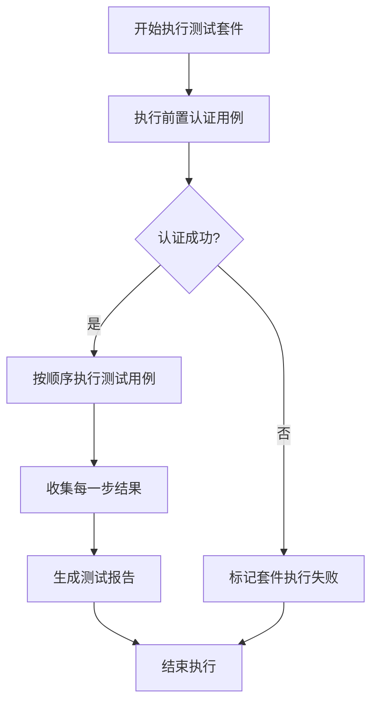

# 测试平台系统设计方案

针对您需要的测试平台系统，我为您设计了一个基于SpringBoot后端和React前端的解决方案。以下是详细的设计思路和实现方案。

## 页面结构设计

### 1. 整体布局
- 左侧导航菜单
- 顶部状态栏（显示用户信息、系统状态等）
- 中央内容区域

### 2. 主要功能模块

#### 2.1 系统配置
- 被测试系统配置（名称、URL、认证方式等）
- 全局变量设置
- 邮件和通知配置

#### 2.2 测试用例管理
- 用例列表（支持分类、搜索、筛选）
- 用例创建/编辑表单
- 用例导入/导出功能

#### 2.3 测试套件管理
- 套件列表和详情
- 套件编辑（拖拽排序用例）
- 套件依赖和条件设置

#### 2.4 测试执行
- 执行历史记录
- 手动执行界面
- 定时任务设置

#### 2.5 报告中心
- 测试报告列表
- 报告详情和图表展示
- 报告导出功能

## 关键功能实现方案

### 1. 认证处理机制
由于被测试系统需要认证，我们可以设计一个"前置认证用例"机制：

```javascript
// 认证用例示例结构
{
id: "auth-case-001",
name: "用户登录认证",
type: "API",
method: "POST",
url: "/api/login",
headers: {
"Content-Type": "application/json"
},
body: JSON.stringify({
username: "${global.username}",
password: "${global.password}"
}),
extractors: [
{
type: "JSON",
expression: "$.data.token",
variable: "authToken"
}
]
}
```

### 2. 测试套件执行流程


### 3. 测试用例数据结构设计

```javascript
// 测试用例基础结构
{
id: "string",
name: "string",
type: "API|Business|UI", // 测试类型
description: "string",
config: {
method: "GET|POST|PUT|DELETE", // 仅API类型需要
url: "string", // 仅API类型需要
timeout: 10000,
retries: 0
},
assertions: [
{
type: "statusCode", // statusCode|responseBody|responseTime
expected: 200,
actual: null,
result: null
}
],
extractors: [
{
type: "json", // json|header|cookie
expression: "string", // 如 $.data.token
variable: "string" // 存储到的变量名
}
],
preconditions: [], // 前置条件
postactions: [] // 后置动作
}
```

## React前端实现示例

```jsx
// 测试套件执行组件示例
import React, { useState } from 'react';
import { executeTestSuite, getExecutionStatus } from '../services/api';

const TestSuiteExecutor = ({ testSuite }) => {
const [execution, setExecution] = useState(null);
const [currentStep, setCurrentStep] = useState(0);
const [results, setResults] = useState([]);
const [isRunning, setIsRunning] = useState(false);

const handleStartExecution = async () => {
setIsRunning(true);
const executionId = await executeTestSuite(testSuite.id);
setExecution({ id: executionId });

// 轮询获取执行状态
const interval = setInterval(async () => {
const status = await getExecutionStatus(executionId);

setCurrentStep(status.currentStep);
setResults(status.results);

if (status.completed) {
clearInterval(interval);
setIsRunning(false);
setExecution({ ...execution, ...status, completed: true });
}
}, 1000);
};

return (
<div className="test-suite-executor">
<div className="execution-controls">
<button
onClick={handleStartExecution}
disabled={isRunning}
>
{isRunning ? '执行中...' : '开始执行'}
</button>
</div>

<div className="execution-progress">
<h3>执行进度</h3>
<div className="progress-bar">
<div
className="progress-fill"
style={{ width: `${(currentStep / testSuite.testCases.length) * 100}%` }}
/>
</div>
<span>步骤 {currentStep + 1} / {testSuite.testCases.length}</span>
</div>

<div className="step-results">
{results.map((result, index) => (
<TestCaseResult
key={index}
result={result}
isCurrent={index === currentStep}
/>
))}
</div>
</div>
);
};

export default TestSuiteExecutor;
```

## SpringBoot后端设计要点

### 1. 执行引擎设计

```java
// 伪代码示例
@Service
public class TestExecutionEngine {

@Autowired
private TestCaseService testCaseService;

@Autowired
private VariableManager variableManager;

public TestSuiteResult executeTestSuite(String suiteId) {
TestSuite suite = testSuiteService.getTestSuite(suiteId);
TestSuiteResult result = new TestSuiteResult(suiteId);

// 执行前置认证
TestCase authCase = suite.getAuthTestCase();
if (authCase != null) {
TestCaseResult authResult = executeTestCase(authCase);
result.addTestCaseResult(authResult);

if (!authResult.isSuccess()) {
result.setStatus(TestStatus.FAILED);
return result;
}
}

// 按顺序执行测试用例
for (TestCase testCase : suite.getTestCases()) {
TestCaseResult caseResult = executeTestCase(testCase);
result.addTestCaseResult(caseResult);

// 如果某一步失败且设置了停止条件，则终止执行
if (!caseResult.isSuccess() && suite.isStopOnFailure()) {
result.setStatus(TestStatus.FAILED);
break;
}
}

return result;
}

private TestCaseResult executeTestCase(TestCase testCase) {
// 根据测试类型调用不同的执行器
TestExecutor executor = TestExecutorFactory.getExecutor(testCase.getType());
return executor.execute(testCase, variableManager);
}
}
```

### 2. API测试执行器示例

```java
@Component
public class ApiTestExecutor implements TestExecutor {

@Override
public TestCaseResult execute(TestCase testCase, VariableManager variableManager) {
ApiTestCase apiTestCase = (ApiTestCase) testCase;
TestCaseResult result = new TestCaseResult(testCase.getId());

try {
// 替换变量
String resolvedUrl = variableManager.replaceVariables(apiTestCase.getUrl());
String resolvedBody = variableManager.replaceVariables(apiTestCase.getBody());

// 执行HTTP请求
HttpResponse response = httpClient.executeRequest(
apiTestCase.getMethod(),
resolvedUrl,
apiTestCase.getHeaders(),
resolvedBody
);

// 验证断言
for (Assertion assertion : apiTestCase.getAssertions()) {
boolean assertionResult = assertion.validate(response);
result.addAssertionResult(assertionResult);
}

// 提取变量
for (Extractor extractor : apiTestCase.getExtractors()) {
Object value = extractor.extract(response);
variableManager.setVariable(extractor.getVariable(), value);
}

result.setSuccess(true);
} catch (Exception e) {
result.setSuccess(false);
result.setErrorMessage(e.getMessage());
}

return result;
}
}
```

## 数据库设计建议

1. **systems表** - 存储被测试系统配置
2. **test_cases表** - 存储测试用例
3. **test_suites表** - 存储测试套件
4. **test_suite_cases表** - 套件和用例的关联表（含顺序）
5. **executions表** - 存储执行记录
6. **execution_results表** - 存储每个用例的执行结果

## 下一步实施建议

1. 先实现系统配置和测试用例管理功能
2. 开发API测试执行引擎
3. 实现测试套件管理和执行功能
4. 添加报告生成和展示功能
5. 最后实现UI测试和业务测试功能

这个设计应该能满足您的需求，特别是按步骤执行测试套件并生成详细报告的要求。如果您需要更详细的某部分实现方案，我可以进一步提供具体代码和设计。